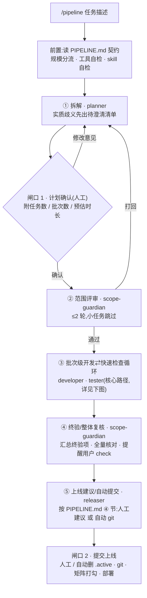
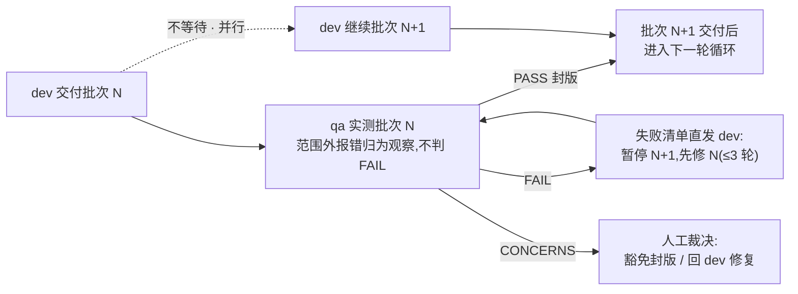

# pipeline-standard — 通用研发流水线标准


端到端「需求 → 开发 → 测试 → 上线」多角色流水线,方法论通用,项目差异由项目根的 `PIPELINE.md` 契约注入。

## 组成

```text
agents/                     5 个通用角色(Claude Code 注册；Codex 以任务模板派发)
  pipeline-scope-guardian   A 范围守门员(只读):审计划、验收,对照需求基线与规范
  pipeline-planner          B 任务拆解员:先澄清歧义,再拆成带验收标准的任务清单
  pipeline-developer        C 开发工程师:只按计划做,checkbox 追踪进度
  pipeline-tester           D 测试工程师:实测 + 对抗式找茬,gate 三态结论,只报不改
  pipeline-releaser         E 发布工程师:变更摘要 + 提交建议,不动 git/不部署
skills/pipeline/SKILL.md    双端 skill：Claude `/pipeline`、Codex `$pipeline`
hooks/pipeline-guard.sh     禁区硬拦截 hook(PreToolUse),流水线运行期间生效
templates/PIPELINE.md       项目契约模板(❏ 占位符)
templates/single-agent-pipeline.md  便携版:单 agent 顺序执行全流程(无子 agent 工具用)
install.sh                  双端安装/同步脚本(Claude agents/hooks + Claude/Codex skills)
init-project.sh             项目接入脚本(拷契约模板 + 配 hook + gitignore,幂等)
```

## 流程

主流程(两道人工闸口):



第 3 步的批次级并行循环(qa 测上一批与 dev 开下一批墙钟重叠):



## 流程特性

### 核心流程

- **澄清前置**:planner 发现实质性歧义先提问,不带着猜测拆计划
- **规模分流**:小任务(≤2 文件、无新依赖)走快速通道,跳过范围评审
- **批次级循环**:任务 >8 个时计划按批次组织(每批 ≤10 任务,plan.md 索引 + plan-<批次>.md 详情),每批 dev 交付即测;qa 测上一批与 dev 开下一批**并行重叠**,fail-fast 不攒到最后,单批打回 ≤3 轮
- **team 直聊**:开发⇄测试打回循环由两个 teammate 直接续跑对话，调度员只监控轮次与裁决，不经手中转(省上下文；异常时回退中转模式)
- **闸口 1 ETA**:计划头部带任务数/批次数/预估时长量级;里程碑级计划附「拆分建议」,人工决定整体跑还是切片跑
- **QA gate 三态(批次级快速检查)**:`PASS / CONCERNS / FAIL`;批次级只覆盖本批核心路径,非核心项与跨批回归记录为「终验复核项」,不占用轮次
- **终验/整体复核**:全部批次 PASS 后,scope-guardian 汇总并执行终验清单,产出 `tmp/pipeline/acceptance.md`,闸口 2 明确提醒用户人工 check
- **禁区硬拦截**:hook 在 `/pipeline` 运行期间(存在 `tmp/pipeline/.active` 标记)按 PIPELINE.md ⑤ 的 `pipeline-guard` 块拦截越界 Write/Edit,不依赖 prompt 自觉
- **打回硬上限**:范围评审 ≤2 轮,测试 ≤3 轮,到顶停报

### 效率与成本

- **批次进度简报**:每批 gate 向用户一行简报(进度 N/M + gate + 下一步);阶段转换(过半/全批交付/异常停止)再发**表格式快照**(批次状态+实测节奏+修正 ETA),长跑进度始终可见
- **上下文瘦身**:plan 按批拆文件、demo/大文档按需切片检索,控制各角色冷启动读入量
- **复测收敛**:打回复测只覆盖修复项 + 影响面 + 快速命令层,首轮已过的重命令不重复跑——打回轮次不再烧全量 token
- **模型分级**:tester 默认 sonnet、releaser 默认 haiku(角色 frontmatter 声明),重判断力角色跟随主会话模型
- **Ponytail 编码纪律**:developer 遵循「最少代码原则」——优先复用现有实现/一行能解不写十行/不添加计划外抽象;测试、类型安全、可访问性、安全边界不许精简
- **ETA 自动校准**:planner 读取历史 `tmp/pipeline/retro.md` 的实测数据反向校准系数;头部同时给出「墙钟时间」(并行后)与「人力时间」两种估算

### 可靠性与恢复

- **断点自恢复**:调度员全程维护 `tmp/pipeline/state.md`(stage/批次/待办/下一步),中断续跑读文件自恢复,不靠口头描述现场
- **跨会话裁决一致性**:CONCERNS 的人工裁决必须写入 `tmp/pipeline/rulings.md`,续跑时以该文件为唯一事实源,避免多会话对同一问题给出不同结论
- **git 写操作默认硬边界**:releaser 及任何角色禁止执行 `git add/commit/push/tag`,除非 PIPELINE.md 第 ④ 节明确声明「自动提交」;默认闸口 2 由人类手工执行,release-notes.md 只提供建议命令
- **预算上限**:闸口 1 可设时长/批次上限,快照对照,≈80% 主动预警
- **skill 安全扫描**:声明式 skill 自动 clone 安装前扫可疑模式(管道执行/外联/越权读写),命中拒装转人工
- **可选通知**:契约声明 webhook(URL 走环境变量)后,闸口等待/待裁决/完成三时机推送,未设静默跳过

### 复盘闭环

- **复盘闭环**:闸口 2 落 `tmp/pipeline/retro.md`(规模 / ETA vs 实际 / 打回轮次),下次 run 拆解时 planner 读取校准预估

## Codex 原生模式与便携模式

Codex 支持本仓库的 `pipeline` skill 原生编排：planner / guardian / dev / qa / releaser 以 Codex 子 agent 运行，批次级 qa 与 dev 也可并行、续跑和直接回传。安装后新开 Codex 会话，使用 `$pipeline <任务描述>`。

Codex 与 Claude Code 共用 `PIPELINE.md`、角色规则、两道闸口、artifact 和打回上限。两端的唯一执行机制差异是 Claude Code 可通过 `.claude/settings.json` 的 `PreToolUse` hook 硬拦截越界写；Codex 当前改为每次写入前的 `PIPELINE.md` 强制校验，不能宣称具备同等级工具层拦截。Claude Code 保留契约声明的自动 CLI/skill 安装；Codex 对全局 CLI 安装、clone 外部 skill 等项目外写入会先请求授权。

若运行环境没有可用的子 agent，才使用下面的单 agent 便携模式。

流水线分三层，前两层与工具无关——**PIPELINE.md 契约**(纯 markdown)与**角色 prompt**(自然语言纪律)；便携版省去编排执行层。

`templates/single-agent-pipeline.md` 是便携版:5 个角色串成单 agent 顺序执行，拷到任意不支持子 agent/hook 的编码工具即可用(Gemini 自定义命令、Cursor 直接粘贴等)。方法论、闸口、批次循环、打回上限与主版完全一致。

原生多 agent 版相对便携版的优势：

- **真角色隔离**:每角色独立 subagent 冷启动,tester 看不到 dev 的实现思路,对抗式找茬是真对抗;便携版同一上下文,靠纪律模拟。
- **批次并行**:qa 测上一批与 dev 开下一批墙钟重叠;便携版只能串行。
- **打回直聊**:dev⇄qa 直接续跑消息，不经调度员转发完整上下文，节省上下文；便携版单上下文无此需求，但也失去上下文瘦身收益。
- **Claude Code 额外具备禁区硬拦截**:⑤ 白名单由 `PreToolUse` hook 机器执行。Codex 保留等价的流程校验，但当前不具备同一层级的 hook 接口。

## 使用

1. 安装(每台机器一次):`git clone` 本仓库后 `bash install.sh`(同时安装 Claude Code 与 Codex；可传 `--claude` 或 `--codex` 限定目标)。
2. 项目接入:`bash init-project.sh /path/to/项目`(拷契约模板 + Claude hook + gitignore；Codex-only 可用 `--codex` 跳过 Claude 配置，详见「接入新项目」一节),然后编辑项目根的 `PIPELINE.md` 逐项替换 ❏。契约随项目 git 管理。
3. 在项目会话中触发:Claude Code 用 `/pipeline <任务描述>`；Codex 用 `$pipeline <任务描述>`。
4. 中间产物在项目的 `tmp/pipeline/`(plan.md + plan-<批次>.md / qa-report.md / release-notes.md / retro.md / state.md)。同一项目同一时刻只跑一条 `/pipeline`(artifact 是单例,并行会互踩)。
5. 流水线异常中断后若普通编辑被 hook 误拦,删除 `tmp/pipeline/.active` 即可。
6. Codex 使用原生 skill；没有子 agent/hook 的其他工具使用便携模式(见上节)。

## 角色工具箱(推荐)

通用层不硬编码任何工具——由项目契约 ③ 声明,`/pipeline` 启动时自检、缺失自动安装(全局 CLI 型)。求精不求多,每角色 1–2 个;`templates/PIPELINE.md` ③ 节有同份注释清单(含条件启用项)可直接启用。完整安装命令与场景说明见 [tools/quick-install.md](tools/quick-install.md),此处不再重复,避免多份文档不同步。

条件启用(只进模板注释,不进主表):knip(死代码扫描,项目体量大后)、size-limit(bundle 体积门禁,有体积验收条时)、npm audit(依赖漏洞,零安装)。

原则:日常批次 gate 只跑快反馈项(lint/typecheck/单测/E2E 冒烟),重工具(Lighthouse/fuzz/压测)声明为里程碑收口用,避免每次 run 都烧全量。

## 接入新项目

```bash
bash init-project.sh /path/to/项目            # 双端/Claude Code 项目
bash init-project.sh --codex /path/to/项目    # Codex-only 项目，不创建 .claude 配置
```

一条命令完成:拷贝 `templates/PIPELINE.md` 到项目根 + 确认 `.gitignore` 含 `/tmp/`；在 Claude Code 项目中还会合并写入 `.claude/settings.json` 禁区 hook。幂等,重复执行不覆盖已有文件。之后编辑 PIPELINE.md 逐项替换 ❏，再按所用运行时触发流水线。

## 最近更新

- **v3.5.3**: v3.5.2 review 补丁——hook 拦截 Bash 层 git 写操作 / init-project 自动配置 Bash PreToolUse / state.md 五要素示例 / 闸口 1 与便携版双口径 ETA 展示细化
- **v3.5.2**: M1 实战补强——git 写操作硬边界 / 跨会话裁决一致性(rulings.md) / mock 基础设施端点豁免 / init-project 默认 gitignore 守护 / retro 校准 ETA 双口径
- **v3.5.1**: developer 角色引入 Ponytail 编码纪律（最少代码原则）
- **v3.5**: P1 四件套——state.md 断点自恢复 / skill 克隆安全扫描 / 可选 webhook 通知 / 预算上限
- **v3.4**: P0 三件套——复测范围收敛 / retro.md 复盘闭环 / 模型分级（tester=sonnet, releaser=haiku）
- **v3.3**: 便携模式（单 agent 降级版）+ README 流程图

## License

MIT
